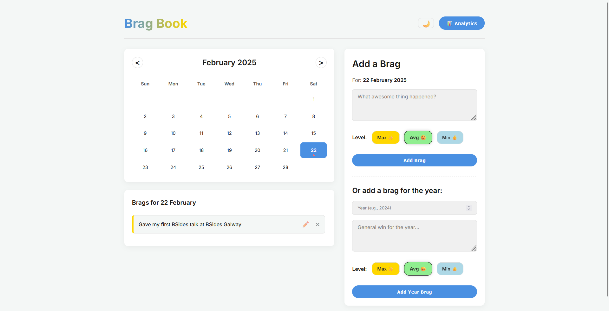

# Brag Book - Track Your Achievements ✨

Ever felt super axious and worried as you grow old?

Do you doubt yourself for not achieveing anything so far?

Worry not, as I present to you - Brag Book.

---
Brag Book is a **FREE**, simple and powerful application which helps you record, display, and celebrate every accomplishment in a clean, elegant way.

Start using Brag Book from today: https://bragbook.thebotsite.com/

## 📷 Screenshots

### 🌑 Dark Mode

### ☀️ Light Mode

## ✨ Features

🌟 Add/edit brags for a particular date or year

📅 View brags for a selected date

💹 Display 'analytics' for a particular year

🥳 Set level for each brag - Max, Avg and Min

## 🚨 Data & Usage

You need not install anything.

Your data is stored locally within your browser.

All you need to do is visit: https://bragbook.thebotsite.com and get started.

## 🧑‍💻 Contribution

Contributions are what make the open-source community such an amazing place to learn, inspire, and create.

If you have ideas to improve Bragbook, feel free to fork the repo and submit a pull request. 🚀

1. Fork the Project
2. Create your Feature Branch (git checkout -b feature/AmazingFeature)
3. Commit your Changes (git commit -m 'Add some AmazingFeature')
4. Push to the Branch (git push origin feature/AmazingFeature)
5. Open a Pull Request

## ☕ Support & Donations

As of date, Brag Book is available to all the users globally for absolutely no cost - I solely bare the cost of running this application.

Your support and donations would help me keep this project alive 💖 

  

➡️ Alternatively you can use the following link: https://buy.stripe.com/bIY5lQfrr8iX7LybII

